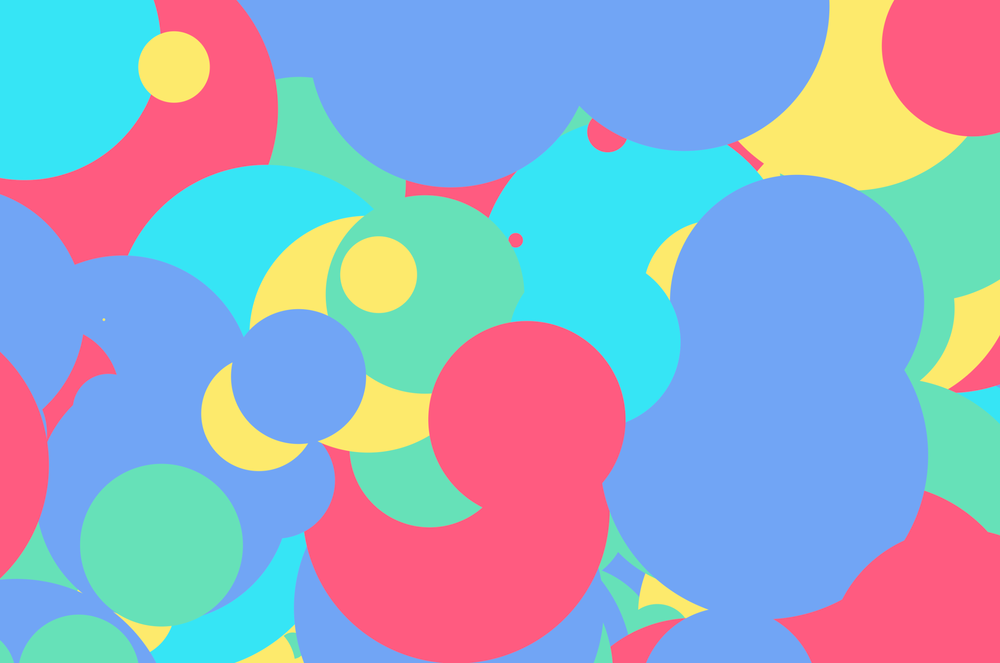

# canvas-random-circles-artwork

Every artist has their medium. From the ancient to the modern - each medium guides the artist with a framework of expression. My medium? The html5 canvas. Inspired by Jackson Pollock and the Mozilla Internet Health Report I present canvas-random-circles-artwork a randomly-generated work of digital art!

